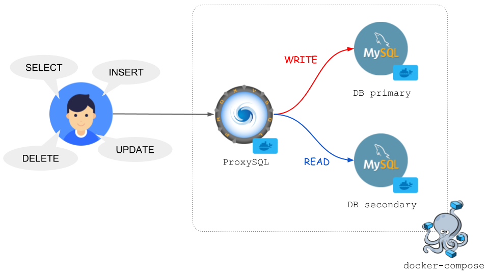

Docker MySQL master-slave replication 
========================

## What is ProxySql?




MySQL master-slave replication with using Docker. 

## Run

Run command to configure **MySQL master-slave replication**  docker-compose up -d

```
docker-compose up -d
```

#### Make changes to master

```
docker exec master sh -c "export MYSQL_PWD=password; mysql -u root mydb -e 'create table code(code int); insert into code values (100), (200)'"
```

#### Read changes from slave to "slave04"

```
docker exec slave01 sh -c "export MYSQL_PWD=password; mysql -u root mydb -e 'select * from code \G'"
```

```
docker exec slave02 sh -c "export MYSQL_PWD=password; mysql -u root mydb -e 'select * from code \G'"

```

## Troubleshooting

#### Check Logs

```
docker-compose logs
```

#### Check running containers

```
docker-compose ps
```

#### Clean data dir

```
rm -rf ./user-data/*
```

#### Run command inside "master"

```
docker exec master sh -c 'mysql -u root -p111 -e "SHOW MASTER STATUS \G"'
```

#### Run command inside "slave01" to "slave04"

```
docker exec slave01 sh -c 'mysql -u root -p111 -e "SHOW SLAVE STATUS \G"'
```

### Check slave

```
mysql -uroot -p111 -h127.0.0.1 -P5500 mydb
```

```
show slave hosts;
+-----------+------+------+-----------+--------------------------------------+
| Server_id | Host | Port | Master_id | Slave_UUID                           |
+-----------+------+------+-----------+--------------------------------------+
|        22 |      | 3306 |         1 | ed3fca51-8069-11ec-a78e-0242c0a84005 |
|        40 |      | 3306 |         1 | ed642236-8069-11ec-8164-0242c0a84006 |
|        11 |      | 3306 |         1 | ed5fb584-8069-11ec-a236-0242c0a84003 |
|        50 |      | 3306 |         1 | ecd284fe-8069-11ec-a3f3-0242c0a84007 |
|        30 |      | 3306 |         1 | eb6f6be2-8069-11ec-9dc3-0242c0a84004 |
+-----------+------+------+-----------+--------------------------------------+
5 rows in set (0.002 sec)
```


#### Enter into "master"

```
docker-compose exec master bash
```

#### Enter into "slave01" to "slave04"

```
docker-compose exec slave01 bash
```


#### ProxySQL ####

```
mysql -h127.0.0.1 -P6032 -uradmin -pradmin --prompt "ProxySQL Admin>"
```

```
SELECT hostgroup_id, hostname, status, comment FROM runtime_mysql_servers;
```

### QUERY ###

```
SELECT hostgroup_id, hostname, status, comment FROM runtime_mysql_servers;
+--------------+----------+--------+--------------+
| hostgroup_id | hostname | status | comment      |
+--------------+----------+--------+--------------+
| 10           | master   | ONLINE | write server |
| 20           | slave05  | ONLINE | read server  |
| 20           | slave04  | ONLINE | read server  |
| 20           | slave03  | ONLINE | read server  |
| 20           | slave02  | ONLINE | read server  |
| 20           | slave01  | ONLINE | read server  |
+--------------+----------+--------+--------------+
6 rows in set (0.002 sec)
```

```
SELECT hostgroup, srv_host, status, ConnUsed, MaxConnUsed, Queries FROM stats.stats_mysql_connection_pool ORDER BY srv_host;
+-----------+----------+--------+----------+-------------+---------+
| hostgroup | srv_host | status | ConnUsed | MaxConnUsed | Queries |
+-----------+----------+--------+----------+-------------+---------+
| 10        | master   | ONLINE | 0        | 0           | 0       |
| 20        | slave01  | ONLINE | 0        | 0           | 0       |
| 20        | slave02  | ONLINE | 0        | 0           | 0       |
| 20        | slave03  | ONLINE | 0        | 0           | 0       |
| 20        | slave04  | ONLINE | 0        | 0           | 0       |
| 20        | slave05  | ONLINE | 0        | 0           | 0       |
+-----------+----------+--------+----------+-------------+---------+
6 rows in set (0.005 sec)
```

```
SELECT rule_id, active, match_pattern, destination_hostgroup, cache_ttl, apply FROM mysql_query_rules;
+---------+--------+-----------------------+-----------------------+-----------+-------+
| rule_id | active | match_pattern         | destination_hostgroup | cache_ttl | apply |
+---------+--------+-----------------------+-----------------------+-----------+-------+
| 100     | 1      | ^SELECT .* FOR UPDATE | 10                    | NULL      | 1     |
| 200     | 1      | ^SELECT .*            | 30                    | NULL      | 1     |
| 300     | 1      | .*                    | 10                    | NULL      | 1     |
+---------+--------+-----------------------+-----------------------+-----------+-------+
3 rows in set (0.002 sec)
```

#### ProxySQL UI ####

We have also enabled the web stats UI with admin-web_enabled=true.To access the web UI, simply go to the Docker host in port **6080**, for example: **http://ip_server_docker:6080** and you will be prompted with username/password pop up. Enter the credentials as defined under admin-stats_credentials and you should see the following page:
